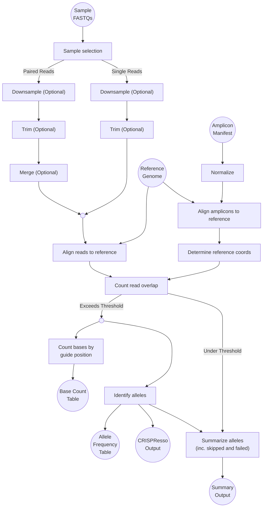

# Nextflow Gene Editing Pipeline

## Quick Start

To run the pipeline:

```console
$ ./run [WORKFLOW FILE] [CONFIG FILE] [NEXTFLOW OPTIONS AND PIPELINE PARAMETERS...]
```

Docker will be used, with the default `nf-gene-editing-ngs:latest`
image, if it is available. Otherwise, Singularity will be used, pulling
said Docker image from Artifactory (eg, `artifacts.example.com/functional-genomics`).
The image (and tag) can be overridden using the `IMAGE` (and `TAG`)
environment variables; this includes using local `.sif` files with
Singularity (e.g., `IMAGE=/path/to/my/image.sif ./run.sh`).

> [!NOTE]
> If `nf-gene-editing-ngs.sif` exists in the working directory, that
> will be used as the default image for Singularity, without having to
> specify the `IMAGE` value.

If SLURM is detected, it will be used as the Nextflow executor. This can
be overridden by setting the `NO_HPC` environment variable (to
anything), for local execution.

## Configuration

### Profiles

The `run` script is designed to select the appropriate combination of
profiles, depending on the environment.

#### Execution

| Profile | Description     |
| :------ | :-------------- |
| `local` | Local execution |
| `hpc`   | SLURM execution |

#### Containerisation

| Profile       | Description                  |
| :------------ | :--------------------------- |
| `docker`      | Docker containerisation      |
| `singularity` | Singularity containerisation |

### Parameters

> [!TIP]
> The `--help` flag can be passed to the pipeline for usage
> instructions.

Parameters are exposed to the pipeline, via Nextflow, as `--PARAMETER
[VALUE]`; where `VALUE` is not required for on/off flags. For example,
`--genome hg19` and `--no_trimming`. Alternatively, the parameters can
be specified as a YAML or JSON file and passed to Nextflow via the
`-params-file` argument:

```console
$ nextflow run main.nf -param-file path/to/my/config.yaml
```

or, more simply:

```console
$ ./run path/to/my/config.yaml
```

#### Reference Genome Identifier and Base Directory

* **`genome`** (required) \
  Reference genome identifier

* **`genome_dir`** (default: `ref_genomes`) \
  The prefix path to the reference genome

Reference genome identifiers are defined in
[`conf/ref.config`](/conf/ref.config) and currently include:

| Reference Genome ID | Description |
| :------------------ | :---------- |
| `hg19`              | Human (v19) |
| `hg38`              | Human (v38) |
| `mm10`              | Mouse       |
| `rn6`               | Rat         |

#### Sample Selection Configuration

* **`fastq_dir`** (required) \
  Path to sample FASTQs

* **`samples_pattern`** (default: `Illumina`) \
  Filename pattern preset, to match input files

* **`samples_include`** \
  Included sample filenames, as an exact match (comma-separated)

* **`samples_include_regex`** \
  Included sample filenames, as a regular expression

* **`samples_exclude`** \
  Excluded sample filenames, as an exact match (comma-separated)

* **`samples_exclude_regex`** \
  Excluded sample filenames, as a regular expression

* **`samples_process_undetermined`** \
  Process undetermined samples (leave unset to skip undetermined
  samples)

Valid sample filename pattern presets are:
* `Illumina`

> [!NOTE]
> * `samples_include` and `samples_exclude` override
>   `samples_include_regex` and `samples_exclude_regex`, respectively.
> * Inclusion overrides exclusion.

> [!NOTE]
> `samples_include_regex` and `samples_exclude_regex` expect regular
> expressions in a form compatible with [`java.util.regex.Pattern`](https://docs.oracle.com/javase/8/docs/api/java/util/regex/Pattern.html).

> [!CAUTION]
> Sample files must not contain `|` or `/`-characters in their
> filenames.

#### Sample and Experiment Metadata

* **`metadata`** \
  Path to the sample and experiment metadata YAML

The sample and experiment metadata YAML file should have the following
schema:

```yaml
samples:
  # Object where each key is the sample name, matching that extracted
  # from the input sample FASTQ files
  <SAMPLE NAME>:
    # List of controls (sample names)
    controls:
    - <SAMPLE NAME>
    # etc.

    # List of amplicons (amplicon names) relevant to the sample
    # If none are specified, or this key is missing, then the pipeline
    # will try all combinations
    amplicons:
    - <AMPLICON NAME>
    # etc.

experiment:
  project: <PROJECT NAME>

  # List of contacts responsible for the experiment
  contacts:
  - name: <NAME>
    role: <ROLE>
    email: <E-MAIL ADDRESS>
  # etc.
```

> [!NOTE]
> Other sample or experiment metadata keys, beyond those described
> above, may be included. They will not be dropped from the published
> output.

#### Amplicons

* **`amplicons`** (required) \
  Path to amplicons YAML

The amplicons YAML file must be a top-level object, where each key
represents an arbitrary name/identifier for the amplicon. The value,
under each key, should contain (at least) the following subkeys:

| Property | Description                                  | Required |
| :------- | :------------------------------------------- | -------- |
| `seq`    | Expected amplicon sequence                   | Yes      |
| `guide`  | Guide sequence                               | Yes      |
| `coding` | Coding sequence within the amplicon sequence | No       |
| `HDR`    | Expected amplicon sequence after HDR         | No       |

For example:

```yaml
---
Some-Amplicon:
  seq: GATTACA
  guide: GATTACA

Another-Amplicon:
  seq: GATTACA
  guide:
  - GATTACA
  - CAT
  HDR: GATTACA
```

> [!NOTE]
> Each amplicon may have multiple `guide`, `coding` and/or `HDR`
> sequences. These can be expressed either as a comma-delimited string,
> or a YAML list of strings.
>
> Additionally, `guide` sequences can be expressed as a YAML list of
> dictionaries (with the sequence under a `seq` key). This option
> matches the format of the normalized, aligned and coordinated amplicon
> output from the pipeline, which is [described below](#amplicon-normalization).

> [!CAUTION]
> The amplicon name is arbitrary, but it must not contain `|` or
> `/`-characters.

##### Amplicon Normalization

Each amplicon is normalized, aligned to and located within the given
reference genome, for both the expected and all guide sequences, as part
of the pipeline. The resulting YAML for each amplicon will look
something like this (modulo order and comments):

```yaml
<AMPLICON NAME>:
  genome: <GENOME ID>

  seq: <DNA SEQUENCE>
  CIGAR: <CIGAR SEQUENCE>

  chr: <CHROMOSOME ID>
  start: <START LOCATION>
  end: <END LOCATION>
  strand: <+/- FOR FORWARD/REVERSE>

  guide:
  - seq: <DNA SEQUENCE>
    coords:
      amplicon:
        start: <GUIDE START LOCATION, WRT AMPLICON>
        end: <GUIDE END LOCATION, WRT AMPLICON>
        strand: <+/-, WRT AMPLICON>
      reference:
        start: <GUIDE START LOCATION, WRT REFERENCE>
        end: <GUIDE END LOCATION, WRT REFERENCE>
        strand: <+/-, WRT REFERENCE>
  # etc.

  # Optional (i.e., per the input)
  coding:
  - <DNA SEQUENCE>
  # etc.

  # Optional (i.e., per the input)
  HDR:
  - <DNA SEQUENCE>
  # etc.
```

> [!TIP]
> Genomic coordinates are expressed in the [BED standard](https://genome.ucsc.edu/FAQ/FAQformat.html#format1).

> [!TIP]
> The normalized amplicon output can be used as the input amplicon YAML
> file, to allow convenient rerunning of the pipeline.

> [!CAUTION]
> If a guide sequence _cannot_ be found in the amplicon, either forward
> or in reverse complement, then its `coords` key will not be present;
> replaced with a `failed` key.

#### Output

* **`outdir`** (default `output`) \
  Output directory

#### Read Count Control

* **`max_reads`** (default `20000`) \
  Read count threshold to trigger downsampling (leave unset to disable)

* **`min_reads_per_amplicon`** (default `500`) \
  Minimum amplicon read overlap count

* **`max_reads_per_amplicon`** (default `10000`) \
  Maximum amplicon read overlap count

#### Merging Configuration

* **`merge_mode`** (default `merge`) \
  Paired sample merging strategy

* **`merge_min_overlap`** (default `4`) \
  Minimum read overlap count

* **`merge_max_overlap`** (default `150`) \
  Maximum read overlap count

Valid paired sample merging strategies are:

| Strategy   | Description                                                                                                               |
| :--------- | :------------------------------------------------------------------------------------------------------------------------ |
| `auto`     | Merge paired-end reads, process the merged reads and remaining unmerged reads                                             |
| `merge`    | Merge paired-end reads, process the merged reads but drop the unmerged reads                                              |
| `both`     | Merge paired-end reads and process the merged reads; also process the original reads through the single-end read pipeline |
| `no-merge` | Don't merge the paired-end reads and instead process them as single-end reads                                             |

#### Trimming Configuration

* **`no_trimming`** \
  Do not perform trimming (leave unset to trim)

* **`trim_bases`** (default `6`) \
  Number of bases to trim

#### Aligner Configuration

* **`aligner_profile`** (default `standard`) \
  Profile to apply to the aligner (Bowtie2)

* **`aligner_custom_read_args`** \
  Custom profile arguments passed to the aligner (i.e., when using the
  `custom` profile) for read alignment

* **`aligner_custom_amplicon_args`** \
  Custom profile arguments passed to the aligner (i.e., when using the
  `custom` profile) for amplicon alignment

Valid aligner profiles are:

 | Profile    | Description                                                 |
 | :--------- | :---------------------------------------------------------- |
 | `standard` | Standard aligner invocation                                 |
 | `custom`   | Custom profile, allowing arbitrary arguments to the aligner |


> [!NOTE]
> If the `custom` profile is used, at least one of
> `aligner_custom_read_args` and `aligner_custom_amplicon_args` must be
> set. When not set, the `default` profile values are used.

#### CRISPResso Configuration

* **`crispresso_window`** (default `6`) \
  Window (bp) around sgRNA

* **`crispresso_extra_args`** \
  Additional arguments passed to CRISPResso for tuning

#### Base Editing Configuration

* **`base_count_window_before`** (default `0`) \
  Window (bp) before sgRNA

* **`base_count_window_after`** (default `0`) \
  Window (bp) after sgRNA

#### Summary Configuration

* **`frameshift_threshold`** (default `85`) \
  Percentage of frameshift reads necessary to call a knockout genotype

* **`hdr_threshold`** (default `85`) \
  Percentage of HDR reads necessary to call an HDR genotype

* **`unmodified_threshold`** (default `85`) \
  Percentage of unmodified reads necessary to call a wildtype genotype

* **`wt_frameshift_max`** (default `5`) \
  Maximum number of frameshift reads that can be present and still call
  a wildtype genotype

## Pipeline

Here, we summarize what the pipeline actually does on a biological level.
This serves mostly to give context to software developers - most users of this pipeline probably don't need these explanations.

### General context

This pipeline is concerned with the analysis of genome editing experiments.
When biologists talk about "genome editing", they mean changing one or multiple parts of the DNA sequence that makes up an organism's genome.
To understand the motivation behind genome editing, it is important to understand the way information encoded on the genome usually flows.
This is described by the [central dogma of molecular biology](https://en.wikipedia.org/wiki/Central_dogma_of_molecular_biology):
the most elementary carrier of information is DNA, which is *transcribed* into RNA, which then, if we are considering a "protein-coding" region, is *translated* into an amino acid sequence - a protein.
Note, though, that only a small percentage of the genome actually codes for proteins, and furthermore there are a couple of exceptions to this information flow.
In any case, it is important to keep in mind that RNA and proteins are *functional* molecules, while DNA is purely an information carrier.
When translating RNA to proteins, an important notion is the *reading frame*: RNA is read and translated as triplets; for example, the RNA sequence `AAG` will give rise to a Lysine amino acid. If a mutation now removes a single letter in an RNA sequence, the reading frame, meaning the "triplet mask" applied to RNA during translation, will be shifted by one, and a very different, non-functional amino acid sequence will be produced. This change in the reading frame is called a "frameshift".

All this means that by editing DNA, we can influence cell functions through the impact on protein-coding genes and non-coding regulatory regions.
Editing DNA (and thus, the genome) has become much, much easier and precise with the advent of [CRISPR-based gene editing](https://en.wikipedia.org/wiki/CRISPR_gene_editing).
In general, genome editing consists of two steps:
1. cut the genome at the desired positions,
2. have the cut site repaired at random or in a specifically desired way.

The difficulty lies mostly in doing 1) with high precision, and this is where the CRISPR mechanism is successfully exploited.
2) can occur mostly by two different methods:
- [**homology-directed repair (HDR)**](https://en.wikipedia.org/wiki/Homology_directed_repair) can be used to insert or replace DNA at the position where existing DNA was cut. Two parts A and B of the (cut) genome are joined by a piece of DNA provided by the experimentalist and whose ends are identical with the freshly cut ends of the existing DNA. This mechanism is extremeley precise, but low efficiency, and is used to engineer in specific gene edits.
- [**non-homologuous end joining (NHEJ)**](https://en.wikipedia.org/wiki/Non-homologous_end_joining) does not rely on a template (homologue) as HDR does. Instead, it joins two pieces of DNA directly. It is more error-prone and more efficient than HDR, and allows researchers to disable (or "knock out") a gene by introducing random mutations that cause frameshifts in the gene, preventing it from producing the correct protein.

Once a genome editing experiment has been performed, researchers need to check the outcome.
They are interested in knowing how often HDR or NHEJ happened and determining what specific modifications occurred at the genomic site they were targeting or at other sites that they expect to be prone to erroneous changes.
They thus amplify a region of DNA around the sites of interest using the famous [polymerase chain reaction (PCR)](https://en.wikipedia.org/wiki/Polymerase_chain_reaction) and sequence the result by [next generation sequencing (NGS)](https://en.wikipedia.org/wiki/Massive_parallel_sequencing).
The sequences read from the latter sequencing step are then analyzed using this pipeline.

### Vocabulary

- *amplicon*: the DNA sequence that is amplified by PCR
- *read*: a single DNA sequence as determined by a sequencing method. This is what the sequencing machine spits out, and it might have errors and thus not exactly correspond to the real DNA sequence in the sample.
- *reference [genome]*: researchers have, for each organism, agreed on a set of reference genomes, meaning a reference DNA sequence for that organism's genome. In reality, there is not a single, say, human with exactly the DNA sequence specified in the human reference genome, because mutations necessarily occur. "Reference" is to be understood more in a sense of "benchmark", meaning, an agreed-upon genome to which individual genomes can be compared. Of a single reference genome there might be multiple versions, for example, the human reference genome gets updated every ~10 years and the current version is called "hg38" or "GRCh38", while the previous one is "hg19" or "GRCh37". Other reference genomes exist and differ in the way they are assembled. It is thus important to exactly specify the reference genome one is working with.
- *read alignment*: a sequencing machine spits out just a string of letters (*read*) representing a DNA sequence, but to know to which location in the genome this sequence corresponds, it has to be *aligned* to a reference genome. Essentially, alignment checks where in the reference genome a given read best matches. It then tells you that your read likely corresponds to, say, basepairs 12322 - 12364 on chromosome 2.
- *overlap*: this is currently used in two different contexts with different meanings:
  - if you have two sequences that have an overlapping part, e.g. the sequences `AGCCAT` and `CCATTG`, then the overlap is the number of base pairs that these reads overlap (in this case, `length(CCAT)=4`)
  - if you have an "index sequence" (in our case, an amplicon) and a set of other sequences (in our case, reads), you can count how many of the reads have a sufficient minimal overlap (in the sense of the first definition) with the amplicon, and that count is called "overlap".
  See also [issue #75](https://github.com/pfizer-rd/nf-gene-editing-ngs/issues/75) that tracks removing this ambiguity.
- *single-end read*: this is a read where the sequencer read the DNA sequence only in one direction, as opposed to a...
- *paired-end read*: ... where the sequencer takes a DNA sequence and reads it twice, first a defined read length from one end, and then the (usually) same length from the opposite end.
- *allele*: a specific version / variation of a given DNA sequence. In our case, alleles are the different variants of the DNA sequence that result from gene editing at a specific site.

### High-level pipeline descriptions

Equipped with the above context and vocabulary, below follows a somewhat high-level description of what the pipeline actually does.

> [!NOTE]
> It is common parlance in NGS to use "Read 1" and "Read 2" (note the singular) to refer to the _set_ of forward and reverse reads in a sample.
> In the following, "reads" refers to all the sequences in a sample, and we try to be very explicit in order to avoid any confusion.
> You will find the common NGS parlance mentioned above in the code itself, though.

1. In two independent steps, the two main data inputs (amplicons, samples (that each contain many reads)) of the pipeline are preprocessed:
   - amplicons:
     - sequences are normalized (specifically, transformed into upper case letters)
     - sequences are aligned to the reference genome
     - files resulting from alignment are not really "human-readable", so the coordinates (notably the chromosome and the start / end position with respect to the reference genome) of the amplicon sequences are calculated
     - from the coordinates, one YAML file for each amplicon is generated
   - (paired) sample reads:
     - reads are randomly subsampled,
     - reads are trimmed, meaning that uninformative and low-quality heading and trailing sequence parts and too short reads are removed
     - paired reads are merged, meaning that if the forward and reverse sequences overlap, these paired reads are merged into one single sequence
     - merged reads are aligned to the reference genome.
2. Now, for each sample and each amplicon, the number of reads in the sample that overlap the amplicon is determined and, depending on a minimum overlap threshold,
   - if the number of overlapping reads is above the threshold, the pair will be passed on for subsequent analysis,
   - or, if below the threshold, the pair stored for reporting, but will be excluded from any further processing.
3. Sample / amplicon combinations that pass the filter in 2) are now subject to allele analysis using the [CRISPResso](https://github.com/lucapinello/CRISPResso) software. This results in a range of plots and tables with the desired information, such as proportion of HDR and NHEJ outcomes, frameshift / inframe mutations, ...
4. The CRISPResso results obtained in 3) are then summarized: based on user-defined thresholds for the number of frameshift mutations, HDR outcomes, and the number of unmodified reads in a sample, an amplicon is classified either as a knockout, HDR, wild-type or unspecified. Also, a summary table is produced that also information about the sample / amplicon pairs that were filtered out in 2).
5. In a final post-processing step, all allele frequency tables produces in 3) are combined into a gzipped text file.

### Architecture and Implementation

This pipeline is a Nextflow reimplementation of (and subsequent
iteration on) the [Haskell-based CRISPResso pipeline](https://github.com/pfizer-rd/crispr-ngs-pipeline).

Broadly, the pipeline is constructed like so:



> [!TIP]
> This diagram is simplified, to remove implementation details that
> obscure the flow. This is particularly true of the experimental
> diagnostic data that is generated at each step and aggregated into a
> final output.
>
> The full diagram can be generated by Nextflow with:
>
> ```console
> $ nextflow run main.nf -preview -with-dag OUTPUT
> ```
>
> See the [Nextflow documentation](https://www.nextflow.io/docs/latest/tracing.html#dag-visualisation)
> for details.

> [!NOTE]
> The original pipeline made heavy use of passing YAML files around to
> facilitate interprocess communication. Effort has been spent to move
> away from this model where it no longer makes sense, for Nextflow, but
> some vestiges of it remain.

#### Operations

The top-level operations of the pipeline are implemented either as:

* Nextflow [processes](https://www.nextflow.io/docs/latest/process.html),
  when there is a clear mapping from the input to the output of its
  intended sources and sinks.

* Nextflow [subworkflows](https://www.nextflow.io/docs/latest/workflow.html#subworkflows),
  when some degree of data munging is required to present a coherent
  interface.

To express a consistent API, these are not distinguished. They are
exposed via Nextflow modules; the major of which are described herein
alphabetically.

> [!TIP]
> The convention of prefixing processes and workflows with an underscore
> is used to signal that these operations are implementation details and
> don't form part of the "public" API.

##### `acquireMetadata` (in `modules/acquire-metadata.nf`)

Inputs:
1. Sample and experiment metadata YAML path, as a string (or null).

Outputs:
* `samples`: Channel of sample metadata objects, extracted from the
  source YAML file, with the appropriate sample name and embedded
  metadata.
* `experiment`: Channel of experiment metadata YAML file.

> [!NOTE]
> The input can be empty, in which case, the outputs will also be empty.

##### `alignAmpliconsToReference` (in `modules/align-amplicons-to-reference.nf`)

Inputs:
1. Channel of normalized amplicon YAML manifest file.

Outputs:
1. Channel of aligned amplicon YAML manifest file.

##### `alignReadsToReference` (in `modules/align-reads-to-reference.nf`)

Inputs:
1. Channel of prepared reads. That is, tuples of the form:
   * Sample identifier (sample name and read ID).
   * FASTQ file.

Outputs:
* `output`: Channel of aligned reads. That is, tuples of the form:
  * Sample identifier (sample name and read ID).
  * Aligned reads (BAM file and its index).
* `info`: Channel of experimental diagnostic data. This is, tuples of
  the form:
  * Sample identifier (sample name and read ID).
  * Alignment diagnostics YAML file.
* `failed`: Channel of failed sample identifiers.

##### `collectAlleleFrequencies` (in `modules/collect-allele-frequencies.nf`)

Inputs:
1. Channel of CRISPResso analysis directories. That is, tuples of the
   form:
   * Analysis identifier (sample name, read ID and amplicon name).
   * CRISPResso analysis directory.

Outputs:
* (None)

Published:
* `alleles_frequency_table.txt.gz`, tabulated allele frequency data from
  the CRISPResso analyses, is published to the root of the output
  directory.

##### `collectBaseCounts` (in `modules/count-bases-by-guide-position.nf`)

Inputs:
* Channel of guide position base counts. That is, tuples of the form:
  * Analysis identifier (sample name, read ID and amplicon name).
  * Guide position base count file.

Outputs:
* (None)

Published:
* `guide_position_base_counts_counts.txt`, concatenated guide position
  base counts from the base counting analysis, is published to the root
  of the output directory.

##### `countGuidePositionBases` (in `modules/count-bases-by-guide-position.nf`)

Inputs:
1. Channel of sample read, amplicon and overlap. That is, tuples of the
   form:
   * Analysis identifier (sample name, read ID and amplicon name).
   * Aligned reads (BAM and associated index).
   * Single amplicon description YAML file.
   * Read overlap count.

Outputs:
* Channel of guide position base counts. That is, tuples of the form:
  * Analysis identifier (sample name, read ID and amplicon name).
  * Guide position base count file.

Published:
* The guide position base count file is published to the `base-counts`
  subdirectory of the respective analysis subdirectory (named after the
  sample name, read ID and amplicon name, under the output directory).

  If no overlapping guides are found for the amplicon, or if the process
  fails, then a `skipped.yaml` or `error.yaml`, respectively, will be
  written in its place.

> [!TIP]
> The `base-counts` subdirectory may seem superfluous, but is there to
> avoid race conditions where contemporary processes can publish their
> output over each other.

##### `countReadOverlap` (in `modules/count-reads-overlap.nf`)

Inputs:
1. Channel of sample read and amplicon. That is, tuples of the form:
   * Sample identifier (sample name and read ID).
   * Aligned reads (BAM and associated index).
   * Single amplicon description YAML file.
   * Whether the combination was user-specified.

Outputs:
* `toIdentify`: Channel of inputs, augmented with the amplicon overlap
  count, that are either user-specified or exceed the overlap threshold.
  That is, tuples of the form:
  * Analysis identifier (sample name, read ID and amplicon name).
  * Aligned reads (BAM and associated index).
  * Single amplicon description YAML file.
  * Read overlap count.
* `toSkip`: Channel of inputs, augmented with the amplicon overlap
  count, that fail to meet the overlap threshold. That is, tuples of the
  form:
  * Analysis identifier (sample name, read ID and amplicon name).
  * Aligned reads (BAM and associated index).
  * Single amplicon description YAML file.
  * Read overlap count.

##### `determineReferenceCoordinates` (in `modules/determine-reference-coordinates.nf`)

Inputs:
1. Channel of aligned amplicon manifest YAML file.

Outputs:
1. Channel of amplicon manifest YAML file with alignment coordinates.

##### `downsamplePairedReads` (in `modules/downsample.nf`)

Inputs:
1. Channel of paired reads. That is, tuples of the form:
   * Sample name.
   * Read pair FASTQ files.

Outputs:
* `output`: Channel of downsampled (or original, if disabled) reads.
  That is, tuples of the form:
  * Sample name.
  * Downsampled read pair FASTQ files.
* `info`: Channel of experimental diagnostic data. That is, tuples of
  the form:
  * Sample name.
  * Downsampling diagnostics pair YAML files.

> [!NOTE]
> Downsampling is deterministic.

##### `downsampleSingleReads` (in `modules/downsample.nf`)

Inputs:
1. Channel of single reads. That is, tuples of the form:
   * Sample name.
   * FASTQ file.

Outputs:
* `output`: Channel of downsampled (or original, if disabled) reads.
  That is, tuples of the form:
  * Sample name.
  * Downsampled FASTQ file.
* `info`: Channel of experimental diagnostic data. That is, tuples of
  the form:
  * Sample name.
  * Downsampling diagnostics YAML file.

> [!NOTE]
> Downsampling is deterministic.

##### `generateInfoTable` (in `modules/info-table.nf`)

Inputs:
1. Channel of downsampling diagnostics data. That is, tuples of the
   form:
   * Sample name.
   * Downsampling diagnostics YAML file (or files, for paired reads).
2. Channel of single read trimming diagnostics data. That is, tuples of
   the form:
   * Sample name.
   * Trimming diagnostics YAML file.
3. Channel of paired read trimming diagnostics data. That is, tuples of
   the form:
   * Sample name.
   * Trimming diagnostics YAML file.
4. Channel of paired read merging diagnostics data. That is, tuples of
   the form:
   * Sample name.
   * Merging diagnostics YAML file.
5. Channel of read alignment diagnostics data. That is, tuples of the
   form:
   * Sample identifier (sample name and read ID).
   * Alignment diagnostics YAML file.
6. Channel of read overlap diagnostics data. That is, tuples of the
   form:
   * Analysis identifier (sample name, read ID and amplicon name).
   * Overlap count.
7. Channel of allele analysis diagnostics data. That is, tuples of the
   form:
   * Analysis identifier (sample name, read ID and amplicon name).
   * Analysis diagnostics YAML file.

Outputs:
* (None)

Published:
* `info.yaml`, aggregated diagnostics data, is published to the root of
  the output directory.
* `info.txt`, tabulated diagnostics data, is published to the root of
  the output directory.

##### `generateSummaryTable` (in `modules/summary-table.nf`)

Inputs:
1. Channel of allele analysis summaries. That is, tuples of the form:
   * Analysis identifier (sample name, read ID and amplicon name).
   * Summary type (either `results`, `skipped` or `failed`).
   * Analysis summary YAML file.

Outputs:
* (None)

Published:
* `summary.yaml`, aggregated analyses summaries, published to the root
  of the output directory.
* `summary.txt`, tabulated analyses summaries, published to the root of
  the output directory.

##### `identifyAlleles` (in `modules/identify-alleles.nf`)

Inputs:
1. Channel of sample read, amplicon and overlap. That is, tuples of the
   form:
   * Analysis identifier (sample name, read ID and amplicon name).
   * Aligned reads (BAM and associated index).
   * Single amplicon description YAML file.
   * Read overlap count.

Outputs:
* `passed`: Channel of CRISPResso analysis directories. That is, tuples
  of the form:
  * Analysis identifier (sample name, read ID and amplicon name), with
    the sample metadata augmented to indicate a successful analysis
    against the given amplicon.
  * CRISPResso analysis directory.
* `failed`: Channel of failed analyses identifiers.

> [!TIP]
> Currently, only an indication of a failing analysis is available. For
> details of any failure, please consult the Nextflow logs.

##### `identifyAllelesCRISPResso` (in `modules/identify-alleles.nf`)

Inputs:
1. Channel of sample read, amplicon and overlap. That is, tuples of the
   form:
   * Analysis identifier (sample name, read ID and amplicon name).
   * Aligned reads (BAM and associated index).
   * Single amplicon description YAML file.
   * Read overlap count.

Outputs:
1. Channel of CRISPResso analysis directories. That is, tuples of the
   form:
   * Analysis identifier (sample name, read ID and amplicon name).
   * CRISPResso analysis directory.

Published:
* The CRISPResso analysis directory (`CRISPResso_output` and symlinks to
  its most important contents) is published to the `alleles`
  subdirectory of the respective analysis subdirectory (named after the
  sample name, read ID and amplicon name, under the output directory).

> [!NOTE]
> This process is called by the `identifyAlleles` subworkflow (see
> above), which instruments it in such a way that failures can be
> identified.

> [!NOTE]
> A further round of deterministic downsampling can occur at this step.

> [!TIP]
> The `alleles` subdirectory may seem superfluous, but is there to avoid
> race conditions where contemporary processes can publish their output
> over each other.

##### `listSequencingSamples` (in `modules/list-sequencing-samples.nf`)

Inputs:
1. Successful deployment trigger.
2. Channel of sample FASTQ path.

Outputs:
1. Channel of samples that meet the filter criteria, grouped by sample
   name. That is, tuples of the form:
   * Sample name.
   * FASTQ file (or files, for paired reads)

##### `mergePairedReads` (in `modules/merge-paired-reads.nf`)

Inputs:
1. Channel of sample reads. That is, tuples of the form:
   * Sample name.
   * Read pair FASTQ files.

Outputs:
* `output`: Channel of merged reads. That is, tuples of the form:
  * Sample identifier (sample name and read ID).
  * Merged (or otherwise) FASTQ file.
* `info`: Channel of merging diagnostics data. That is, tuples of the
  form:
  * Sample name.
  * Merging diagnostics YAML file.

##### `normalizeAmplicons` (in `modules/normalize-amplicons.nf`)

Inputs:
1. Successful deployment trigger.
2. Channel of amplicon manifest YAML file.

Outputs:
1. Channel of normalized amplicon manifest YAML file.

##### `publishMetadata` (in `modules/publish-metadata.nf`)

Inputs:
1. All sample metadata YAML files concatenated into a single YAML file.
2. Experiment metadata YAML file.
3. Prepared amplicons YAML file.

Published:
* The sample and experiment metadata YAML, as `metadata.yaml`, insofar
  as it existed in the input.
* The prepared (i.e., normalized and aligned) amplicons YAML, as
  `amplicons.yaml`.
* The input parameters for the pipeline run, as `params.yaml`.

##### `reportFailedAnalysis` (in `modules/identify-alleles.nf`)

Inputs:
1. Channel of analysis identifiers (sample name, read ID and amplicon
   name).

Outputs:
1. Channel of failed allele analysis summaries. That is, tuples of the
   form:
   * Analysis identifier (sample name, read ID and amplicon name).
   * Summary type (`failed`).
   * Failed analysis summary YAML file.

Published:
* `error.yaml` files, marking failed analysis processes, are published
  to the `alleles` subdirectory of the respective analysis subdirectory
  (named after the sample name, read ID and amplicon name, under the
  output directory).

> [!TIP]
> The `alleles` subdirectory may seem superfluous, but is there to avoid
> race conditions where contemporary processes can publish their output
> over each other.

##### `reportSkippedSamples` (in `modules/count-reads-overlap.nf`)

Inputs:
1. Channel of sample read, amplicon and overlap. That is, tuples of the
   form:
   * Analysis identifier (sample name, read ID and amplicon name).
   * Aligned reads (BAM and associated index).
   * Single amplicon description YAML file.
   * Read overlap count.

Outputs:
1. Channel of skipped allele analysis summaries. That is, tuples of the
   form:
   * Analysis identifier (sample name, read ID and amplicon name).
   * Summary type (`skipped`).
   * Skipped analysis summary YAML file.

Published:
* `skipped.yaml` files, detailing the insufficient overlap count, are
  published under the appropriate analysis subdirectory of the output
  directory (named after the sample name, read ID and amplicon name).

##### `selectAmplicons` (in `modules/select-amplicons.nf`)

Inputs:
1. Channel of samples. That is, tuples of the form:
   * Sample identifier (sample name and read ID).
   * Aligned reads (BAM and associated index).

2. Channel of amplicons. That is, tuples of the form:
   * Amplicon name.
   * Amplicon description YAML.

Outputs:
1. Channel of sample/amplicon pairs for downstream analysis. That is,
   tuples of the form:
   * Analysis identifier (sample name, read ID and amplicon name).
   * Aligned reads (BAM and associated index).
   * Single amplicon description YAML file.
   * Whether the combination is user-specified (i.e., `true` or
     `false`).

##### `splitAmpliconsYaml` (in `modules/split-amplicons-yaml.nf`)

Inputs:
1. Channel of amplicons manifest YAML file.

Outputs:
1. Channel of each amplicon. That is, tuples of the form:
   * Amplicon name (extracted from the input manifest).
   * Amplicon description YAML file.

##### `summarizeAlleles` (in `modules/summarize-alleles.nf`)

Inputs:
1. Channel of CRISPResso analysis directories. That is, tuples of the
   form:
   * Analysis identifier (sample name, read ID and amplicon name).
   * CRISPResso analysis directory.

Outputs:
1. Channel of allele analysis summaries. That is, tuples of the form:
   * Analysis identifier (sample name, read ID and amplicon name).
   * Summary type (`results`).
   * Analysis summary YAML file.

Published:
* `info.yaml`, individual analysis summaries, are published to the
  `alleles` subdirectory of the respective analysis subdirectory (named
  after the sample name, read ID and amplicon name, under the output
  directory).

> [!TIP]
> The `alleles` subdirectory may seem superfluous, but is there to avoid
> race conditions where contemporary processes can publish their output
> over each other.

##### `toSampleMetadata` (in `modules/publish-metadata.nf`)

Inputs:
1. Channel of single-end samples. That is, tuples of the form:
   * Sample name.
   * Sample FASTQ.

2. Channel of paired-end samples. That is, tuples of the form:
   * Sample name.
   * Sample FASTQ.

3. Channel of successful allele analyses. That is, tuples of the form:
   * Analysis identifier (sample name, read ID and amplicon name).
   * Analysis directory.

Outputs:
1. A multi-document YAML file; that is, all the input sample metadata
   YAML files concatenated into a single YAML file.

##### `trimPairedReads` (in `modules/trim-paired-reads.nf`)

Inputs:
1. Channel of paired reads. That is, tuples of the form:
   * Sample name.
   * Read pair FASTQ files.

Outputs:
* `output`: Channel of trimmed (or original, if disabled) reads. That
  is, tuples of the form:
  * Sample name.
  * Trimmed read pair FASTQ files.
* `info`: Channel of experimental diagnostic data. That is, tuples of
  the form:
  * Sample name.
  * Trimming diagnostics YAML file.

##### `trimSingleReads` (in `modules/trim-single-reads.nf`)

Inputs:
1. Channel of single reads. That is, tuples of the form:
   * Sample name.
   * FASTQ file.

Outputs:
* `output`: Channel of trimmed (or original, if disabled) reads. That
  is, tuples
  of the form:
  * Sample name.
  * Trimmed FASTQ file.
* `info`: Channel of experimental diagnostic data. That is, tuples of
  the form:
  * Sample name.
  * Trimming diagnostics YAML file.

## Deployment Workflow

A deployment workflow is included to bootstrap the necessary reference
genome files. This is run at the beginning of the CRISPR workflow, but
can also be run standalone with:

```console
$ ./run deploy.nf [--genome_dir <reference genome base directory>] [OPTIONS...]
```

This will download and install the reference genomes, defined in
[`conf/ref.config`](/conf/ref.config), into the directory defined by the
[`genome_dir` parameter](#reference-genome-identifier-and-base-directory).
Only reference genomes that are missing from the base directory will be
downloaded, so subsequent runs of the pipeline will effectively skip
this step.

<!--

## Image

[Details of the image, its building and CI]

-->
